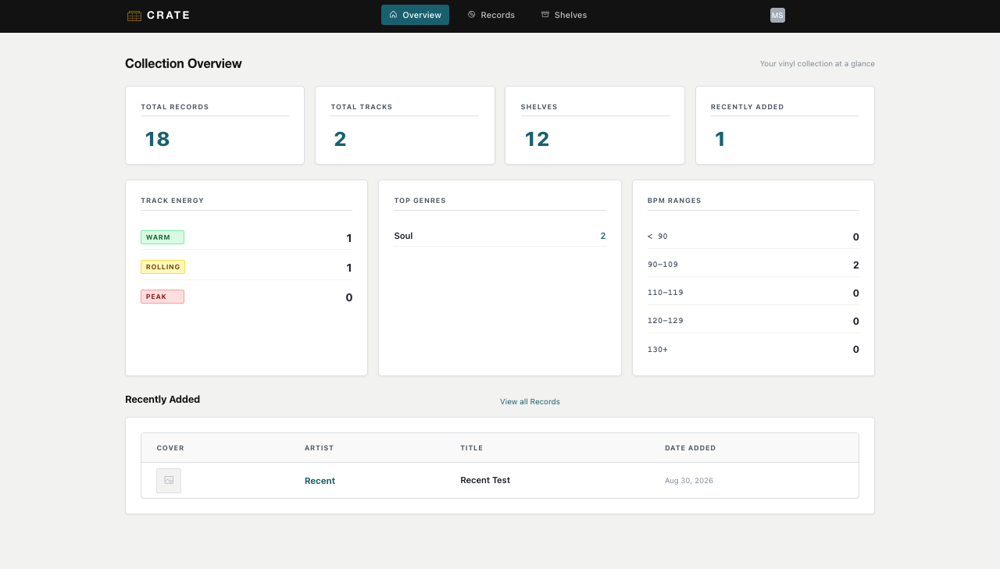
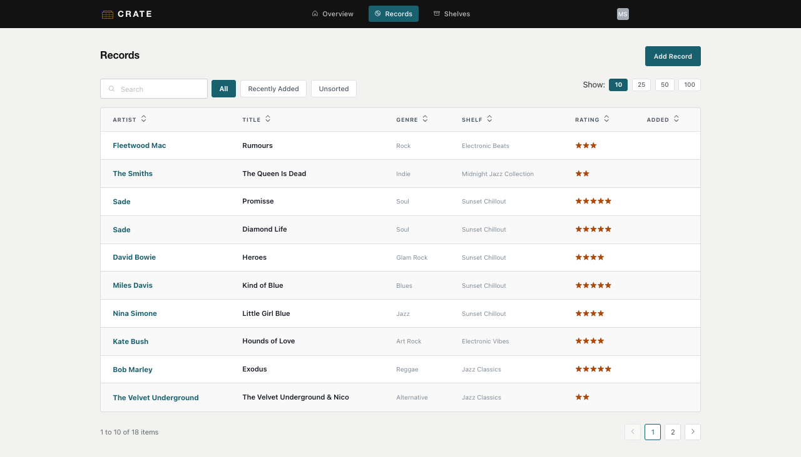
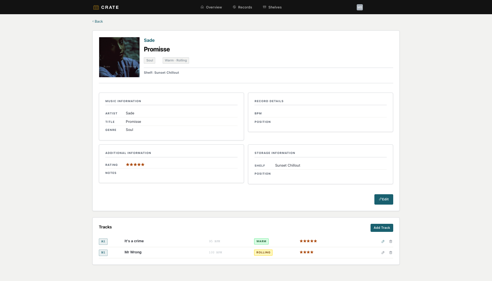
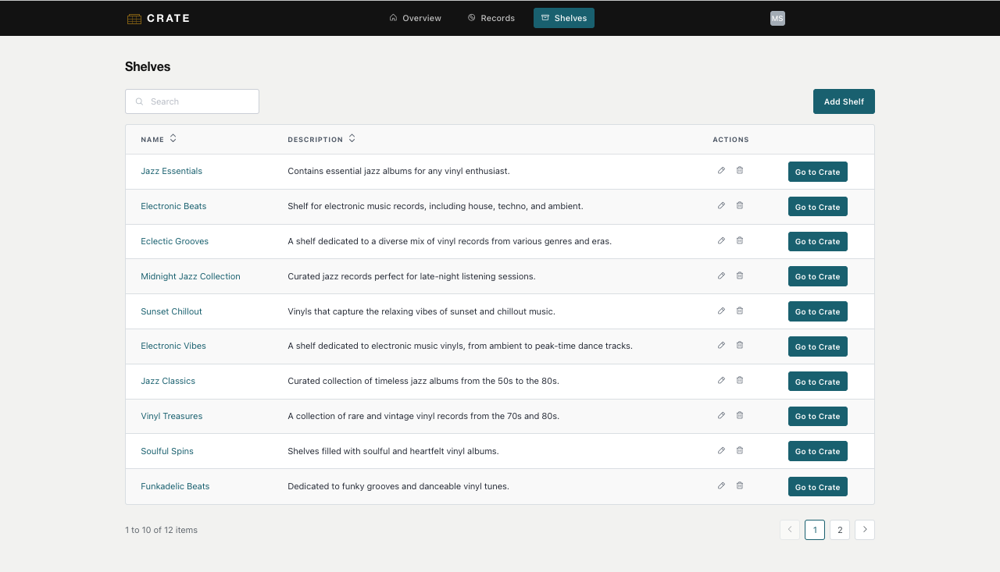
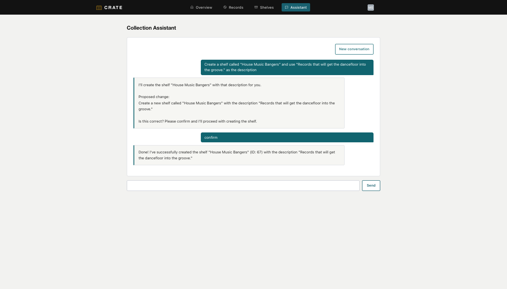
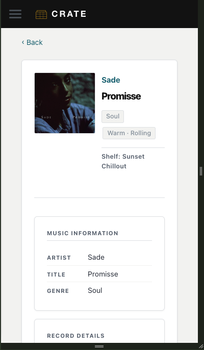

# CRATE — Vinyl Collection Manager

CRATE is a responsive vinyl collection manager for DJs, built with **OutSystems Developer Cloud (ODC)**.

It is designed around the way DJs physically organize and explore record collections: records live inside Shelves/Crates, while musical metadata such as BPM, genre, energy and rating can be stored at **track level**.

The goal is not to automate DJ selection. CRATE helps users understand, organize and navigate their collection while leaving the creative process of choosing and combining records to the DJ.

## Live Demo

**CRATE:** https://personal-5npg68ma-dev.outsystems.app/CRATEVinylCollectionManager/Overview

## Project Context

CRATE was developed as the final application project for an OutSystems AI Developer learning path. The portfolio version is hosted in OutSystems ODC; this repository documents the product, architecture, development decisions and QA process rather than presenting CRATE as a conventional source-code repository.

## Core Features

- Create, edit and delete records
- Create, edit and safely delete Shelves/Crates
- Add and manage individual tracks inside each record
- Track-level metadata: position, title, genre, BPM, energy, rating and notes
- Optional record cover artwork
- Search and collection filtering
- All / Recently Added / Unsorted record views
- Physical crate navigation with **Go to Crate**
- Pagination with 10 / 25 / 50 / 100 page-size options
- Responsive desktop and mobile interface
- Collection Overview with record, track, shelf and recently-added totals
- Energy distribution, top genres and BPM-range summaries
- **Agentic AI Collection Assistant** for natural-language collection queries and constrained collection automation

## Agentic AI Collection Assistant

CRATE includes an Agentic AI Assistant built as a separate ODC Agentic App. It connects natural-language requests to controlled application actions rather than treating the model as the collection database.

The current Assistant can query real collection data, resolve records and shelves, create a new Shelf/Crate and move a Record to a Shelf. Write operations use a human-in-the-loop confirmation flow: the Assistant first resolves the required identifiers, describes the proposed operation and waits for explicit user confirmation before executing it.

The implementation uses ODC Service Actions to expose selected Web App operations to the Agentic App, with local Agent actions acting as controlled adapters. Read payloads are explicitly projected before serialization so the model receives only the data required for each operation. Track-level Energy remains the musical source of truth; legacy Record-level Energy is not exposed by record-listing actions.

The Assistant deliberately does **not** recommend what the DJ should play, build sets, choose track order, transitions or mixes. AI is used to assist collection management, not replace artistic decision-making.

> **Runtime note:** the current portfolio environment uses a trial AI model/provider and occasional transient Assistant connection failures were observed during QA. Core read/write flows were nevertheless validated end-to-end, including persisted record movement verified through both Assistant reads and the application UI.

## Data Model

The project evolved from a record-only catalog into a more accurate model for DJ collections.

### Shelf
Represents a physical shelf or crate used to organize records.

### Record
Represents a physical vinyl release. It contains release-level information such as artist, title, cover artwork, notes, physical position and shelf assignment.

### Track
Represents an individual track belonging to a record. Track-specific musical information is stored here because one record can contain tracks with very different characteristics.

Key track attributes include Position (for example A1, A2, B1), Title, Genre, BPM, Energy, Rating and Notes.

### Energy
A static track metadata classification: **Warm**, **Rolling** and **Peak**.

## Key Design Decision

The initial model stored Genre, BPM and Energy at Record level. During development this was revised because a multi-track record may contain tracks with different genres, tempos and energy levels.

A dedicated **Track** entity was introduced and those attributes — together with Rating — became track-level metadata. This was one of the main data-modeling decisions in the project.

## Collection States

Records can exist in three practical states:

- **Shelved** — assigned to a Shelf/Crate
- **Recently Added** — not yet shelved and recently entered into the collection
- **Unsorted** — explicitly removed from a shelf or awaiting physical organization

Deleting a shelf does **not** delete its records. Affected records are preserved and become Unsorted.

## UX and Interface

CRATE includes dedicated Overview, Records, Shelves and Assistant navigation, responsive record/track layouts, mobile drawer navigation, cover artwork, track energy color coding, star ratings, search/filter controls and responsive pagination.

## Technology and Skills Demonstrated

- OutSystems Developer Cloud (ODC)
- ODC Agentic Apps and AI model integration
- Agent flows and action calling
- Service Actions across application assets
- Human-in-the-loop confirmation for write automation
- Reactive web application development
- Relational data modeling
- CRUD workflows
- Client and server actions
- Aggregates, search and filtering
- Explicit data projection and JSON serialization
- Pagination and UI state
- Binary image upload
- Responsive UI/UX
- Custom CSS refinement
- Debugging, iterative development and functional QA

## Documentation

- [Project Documentation](docs/PROJECT_DOCUMENTATION.md)
- [Development Process](docs/DEVELOPMENT_PROCESS.md)

## Application Preview

### Collection Overview

The Overview provides a quick snapshot of the collection, including records, tracks, shelves, recently added items, track energy, genres and BPM ranges.

### Records

The Records view provides collection search, filtering, ratings, shelf information, pagination and configurable page size.

### Record Details & Track Metadata

Each record combines release-level information with individual track metadata. Tracks can have their own position, BPM, energy, rating and notes.

### Shelves / Crates

Shelves represent the physical organization of the vinyl collection, allowing records to be mapped to real-world crates or storage locations.

### Collection Assistant

The Collection Assistant provides natural-language access to collection data and constrained, user-confirmed automation while keeping artistic DJ decisions outside the Agent's scope.

## Responsive Design

CRATE was designed and refined for both desktop and mobile use.

The mobile interface reorganizes record information and track content for smaller screens while preserving the same collection structure and functionality.

## Status

The current portfolio version is **feature-complete, published and functionally tested**. The Agentic AI extension includes real collection reads and a deliberately limited set of confirmed write operations rather than unrestricted autonomous access.

## Future Direction

The next stage of CRATE is centered on **configurable agency** rather than simply giving the AI more control.

Planned directions include:

- **Expanded collection automation** — additional user-requested operations such as controlled metadata updates and assistance with missing metadata.
- **Agent Permissions & Preferences** — a dedicated control screen where the DJ can choose which operations the Agent may perform, which require confirmation and which remain disabled.
- **Per-attribute AI preferences** — users could decide which metadata fields, such as Genre, BPM or Energy, may receive AI suggestions and whether those suggestions can ever be applied after confirmation.
- **AI-assisted record ingestion** — artwork/photo recognition and external metadata services could prepare Record/Track drafts for user review before saving.
- **Contextual Assistant UI** — evolve the current dedicated Assistant page into a global pop-up/panel available while browsing Records, Shelves and Record Details.
- Discogs or similar metadata integration
- Printable sleeve labels based on track positions
- Richer collection statistics and charts
- Native/mobile exploration
- Customizable Energy types

Even as these capabilities expand, track/set recommendations, automated track ordering, transition selection and other artistic DJ decisions remain intentionally outside CRATE's design scope.
